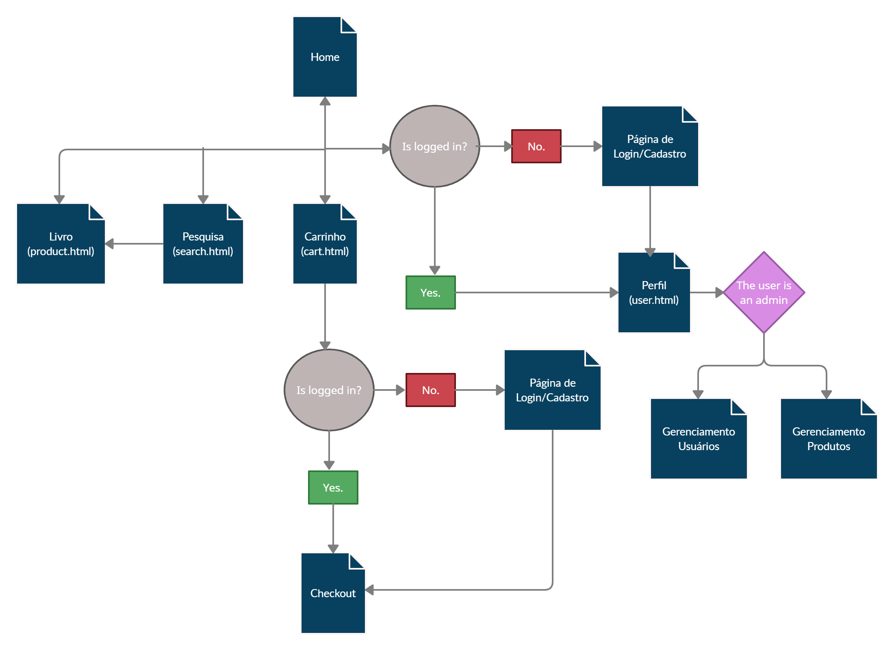
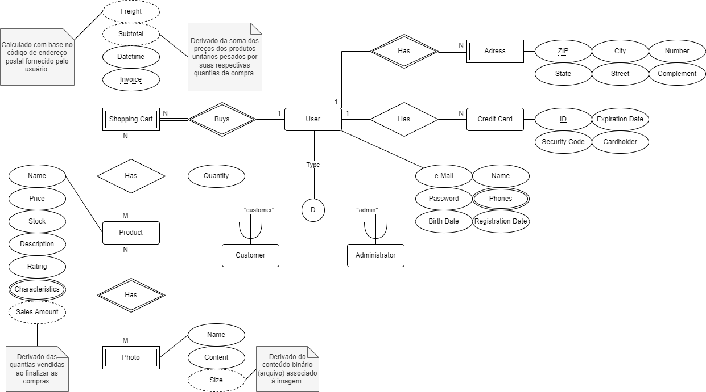

# Sistema de e-Commerce de uma Livraria

Trabalho de finalização da disciplina de Introdução ao Desenvolvimento Web, SCC0219, primeiro semestre de 2022. Em suma, implementa todos os aspectos necessários a um site de e-commerce, incluindo gerenciamento de bases de dados e desenvolvimento fullstack, embora não armazene o projeto em um servidor dedicado.

# Relatório de Projeto

## 0. Colaboradores

- João Lucas Rodrigues Constantino, 11795763
- Gabriel Zanotim Manhani, 11912276
- Nathielle Cristhiny de Oliveira Pereira, 10390252

## 1. Requisitos

### 1.1. Usuários

- Os usuários do Sistema são divididos em duas categorias: administradores e clientes, em que aqueles são responsáveis pelo gerenciamento do estoque comercial e dos serviços disponibilizados, e estes são os usuários-alvo da plataforma — aos quais os produtos e serviços serão oferecidos.

- A todo usuário não cadastrado, deve ser permitido registrar uma conta de cliente, a qual deve receber os seguintes atributos no momento de cadastro: nome, senha, e-mail e telefone de contato, em que todos esses atributos podem ser alterados posteriormente na página de perfil. O Sistema deve, automaticamente, fornecer um número de identificação sintético (ID) ao cliente no momento de cadastro.

- A todo administrador, deve ser permitido a promoção de uma conta de cliente previamente cadastrada para uma conta de administração.

- A todo administrador, deve ser permitido realizar visualização, alteração, adição e remoção (CRUD) de produtos.

- A todo administrador, deve ser permitido realizar CRUD dos demais usuários.

- A todo usuário cadastrado, deve ser permitido realizar CRUD de seus meios de pagamento.

- A todo usuário cadastrado, deve ser permitido realizar CRUD de seus endereços de entrega.

### 1.2. Páginas

- A todo usuário não cadastrado, deve ser permitido acessar as páginas inicial, de apresentação, de produto e de pesquisa, em que esta pode envolver uma categoria cadastrada ou uma busca textual por parte do usuário.

- A todo usuário cadastrado, deve ser permitido acessar as páginas de perfil, de carrinho e de finalização de compra.

- A todo administrador, deve ser permitido acessar a página de gerenciamento de estoque e a página de gerenciamento de usuários; ambas as páginas podem ser acessadas por meio de um menu lateral na página de perfil do administrador. Ainda, na página de gerenciamento de estoque, deve ser permitido acessar a página de gerenciamento do produto.

### 1.3. Produtos

- A todo produto, no momento de cadastro, devem ser fornecidos, no mínimo, um nome e uma ou mais fotografias. Em sua seção de gerenciamento, podem ser adicionados um preço, uma quantia em estoque, uma descrição e demais características — incluindo acabamento, ano da edição, idioma de exibição e número de páginas. Além disso, o Sistema deve, automaticamente, fornecer um número de identificação sintético (ID) ao produto no momento de cadastro.

- O Sistema deve registrar estatísticas de venda do produto, incluindo quantia absoluta de vendas, disponibilizando-as na página de gerenciamento do produto.

- Todo produto deve pertencer a uma ou mais categorias, as quais devem ser adicionadas na página de gerenciamento do produto.

### 1.4. Processo de Compra/Venda

- Na página de produto, devem ser disponibilizadas interfaces para o cálculo de frete e para a compra.

- Ao comprar um produto por meio de sua página, caso o usuário seja cadastrado, uma instância dele deve ser adicionada ao carrinho — cuja atualização deve ser informada por meio de um mostrador de notificação —, e, em caso contrário, um pop-up deve ser apresentado — informando a necessidade de cadastro para prosseguir com a compra.

- Na página de carrinho, devem ser mostradas todas as instâncias de produto adicionadas; a cada instância, uma quantia de compra pode ser alterada — em que o mínimo é uma unidade, e o máximo é toda a quantia atualmente em estoque.

- Na página de carrinho, deve ser disponibilizada uma interface para a finalização de compra.

- Na página de finalização de compra, os detalhes da operação devem ser apresentados juntamente à escolha do meio de pagamento e das informações de endereço de entrega.

- O carrinho deve ser esvaziado somente após finalização da compra.

### 1.5. Meios de pagamento

- Para fins de simplificação do projeto, somente cartões de crédito podem ser cadastrados e utilizados como meios de pagamento.

- Todos os meios de pagamento cadastrados devem ser apresentados em uma seção da página de perfil.

### 1.6. Requisitos não funcionais

- O Sistema deve ser responsivo.

- O Sistema deve apresentar boas medidas de acessibilidade.

- O Sistema deve prover boa usabilidade.

## 2. Descrição do projeto

### 2.1. Protótipo

Os mockups do projeto foram feitos por meio da plataforma Figma, e podem ser acessados para consulta <a href="https://is.gd/VWvgkI" target="_blank">aqui</a>. (<a href="https://github.com/jlrconstantino/bookstore-ecommerce/blob/5ac9e3286a86906763bddbc6f83ba8cca1cd7a9a/img/presentation/adm.jpg" target="_blank">adm</a>)

### 2.2. Diagrama de navegação

O diagrama de navegação planejado para os usuários (clientes e administradores) pode ser visto a seguir:

### 2.3. Base de dados

O Modelo de Entidade Relacionamento pode ser visualizado pelo diagrama a seguir. Note que números sintéticos de registro, isto é, os ID's, não são apresentados no modelo conceitual, sendo somente introduzidos no modelo de implementação.

## 3. Comentários sobre o código

-

## 4. Planos de teste

-

## 5. Resultados de teste

-

## 6. Procedimentos de execução

-

## 7. Problemas identificados

- Problema de responsividade em ambientes variados: o BANNER na página principal fica um pouco deslocado para baixo em certos navegadores.

## 8. Comentários adicionais

-
